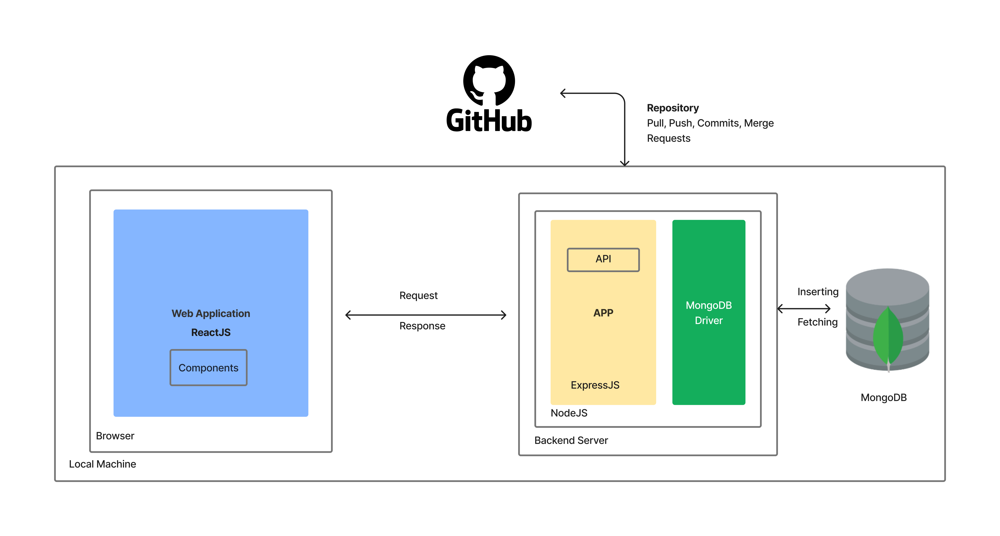
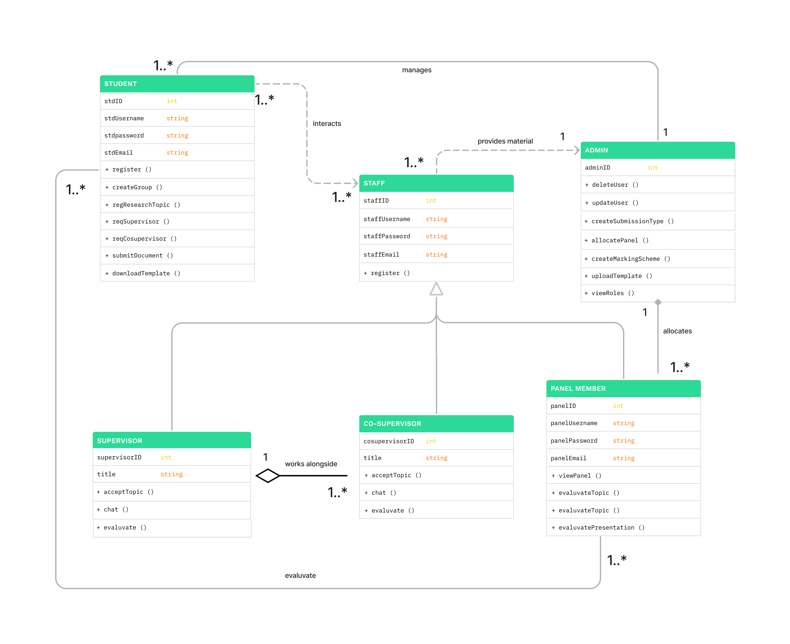

# Project-Management-Tool : Research :sparkles:



## Use Case Scenario :palm_tree:

All SLIIT undergraduates must do a research project in their 4th year. This Research Project module is a 16 credit, two semesters long project. A student group must find a research topic in a specific research field and send it to a supervisor who has interests in the same research field. Once the supervisor accepted the topic, they must find a co-supervisor of the same research interest. After finalizing the supervisor student must send a document including the topic details of the Research.Then topic evaluation panel will evaluate the topic and send feedback to the student group. If the topic is accepted, they can continue to do the project. If rejected, they must find a new topic and submit it back.There are several evaluation stages. Document submissions are evaluated by the supervisor or the co-supervisor. Presentations will be evaluated by a separate panel. The final Thesis will be Double evaluated by the supervisor and a blind reviewer. SLIIT Research project team is looking for a system, which has the capability of managing the Research project and automating certain tasks.

## Getting Started - Installation :computer: :stuck_out_tongue:

Do these steps in the directory of both client and server folders

```
### .env configuration

- Create a .env file in the root directory
- Add the folling KEY and YOUR VALUES

PORT=
NODE_ENV=
MONGODB_URL=
EMAIL_USER=
EMAIL_PWD=
REACT_APP_FIREBASE_API_KEY=
REACT_APP_FIREBASE_AUTH_DOMAIN=
REACT_APP_FIREBASE_DATABASE_URL=
REACT_APP_FIREBASE_PROJECT_ID=
REACT_APP_FIREBASE_STORAGE_BUCKET=
REACT_APP_FIREBASE_MESSAGING_SENDER_ID=
REACT_APP_FIREBASE_APP_ID=

### Starting application

ROOT DIRECTORY (SERVER)
- npm i
- npm start 
  OR
- yarn
- yarn start 

CLIENT DIRECTORY (SERVER)
- cd client
- npm i
- npm start 
  OR
- yarn
- yarn start 

### Testing application

- yarn test
  OR
- npm run test

```


## System Overview :package:

### Class Diagram
Below is the class diagram for this project in which it clearly displays the functions and features of each stakeholder of this project


### Technology Stack
Below are the types of technologies we have used in this project


## Authors :mortar_board:
- [Dissanayake M.C.Y.D  -  IT20013332](https://github.com/Chabbax)
- [Abineshh U  -  IT20025908](https://github.com/)
- [Zihara M.I.F  -  IT20032388](https://github.com/Zihara)
- [Kuruppu S.G  -  IT20061302](https://github.com/)

